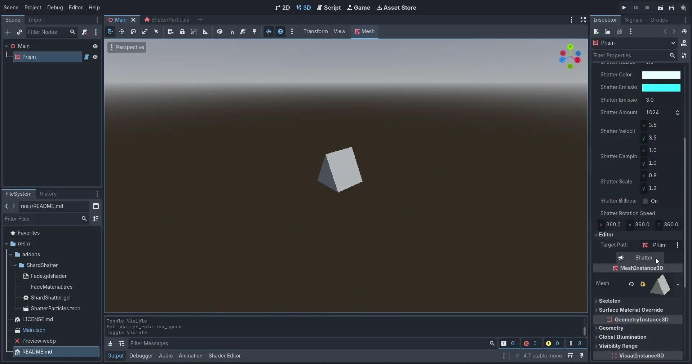

# Shard Shatter

Shatter meshes into shards in Godot 4.

This addon creates a polygon explosion effect similar to Sword Art Online.

## Preview

## Requirements

ShardShatter v2 requires Godot 4.7+, because it uses the new [3D particle rotation](https://github.com/godotengine/godot/pull/112447) feature.

ShardShatter v1 works for Godot 4.4+.

## Usage

1. Add the addon to your game's `addons` folder.
2. Attach the `ShardShatter.gd` script to a node.
3. In the `Editor` group, set `Target Path` to the node you want to shatter (preferably a `MeshInstance3D`).
4. Press `Shatter` to shatter the target node!
5. Alternatively, call the `shatter` method on the node with the script.

## Explanation

The script applies an overlay shader to the mesh instances in the target node, which causes them to fade into a glow.

Then, the target node is hidden, and a large number of GPU particles are emitted from a sphere shape.